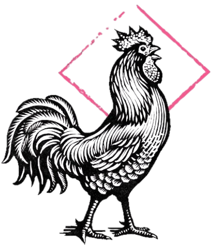

# RoosterRun - HackMyVM (Easy)

## Übersicht

*   **VM:** RoosterRun
*   **Plattform:** HackMyVM (https://hackmyvm.eu/machines/machine.php?vm=RoosterRun)
*   **Schwierigkeit:** Easy
*   **Autor der VM:** DarkSpirit
*   **Datum des Writeups:** 2023-11-30
*   **Original-Writeup:** https://alientec1908.github.io/RoosterRun_HackMyVM_Easy/
*   **Autor:** Ben C.

## Kurzbeschreibung

Das Ziel dieser Challenge war es, Root-Rechte auf der Maschine "RoosterRun" zu erlangen. Der Weg dorthin begann mit der Entdeckung einer verwundbaren CMS Made Simple-Installation (Version <= 2.2.9) auf dem Webserver. Mittels eines bekannten SQL-Injection-Exploits (Exploit-DB 46635) wurden Admin-Zugangsdaten (`admin:homeandaway`) extrahiert und geknackt. Anschließend wurde eine weitere bekannte Schwachstelle in CMSMS (CVE-2019-9055, RCE via Object Injection) mit Metasploit ausgenutzt, um eine Meterpreter-Shell als `www-data` zu erhalten. Als `www-data` wurden MySQL-Credentials (`root:dbpassword`) aus einer Konfigurationsdatei (`config.php`) ausgelesen. In der Datenbank wurde das Klartextpasswort (`4ng3l4`) für den Benutzer `angela` gefunden. Die finale Rechteausweitung zu Root gelang durch Ausnutzung eines unsicheren Cronjob-Skripts (`/opt/maintenance/backup.sh`). Dieses Skript kopierte `.sh`-Dateien aus einem für den Benutzer `matthieu` (zu dem via `su angela` und dann `www-data` zu `matthieu` mit PATH-Hijacking auf `find` eskaliert wurde) beschreibbaren Verzeichnis (`/opt/maintenance/pre-prod-tasks`) in ein anderes Verzeichnis und führte sie dann als Root mit `run-parts` aus.

## Disclaimer / Wichtiger Hinweis

Die in diesem Writeup beschriebenen Techniken und Werkzeuge dienen ausschließlich zu Bildungszwecken im Rahmen von legalen Capture-The-Flag (CTF)-Wettbewerben und Penetrationstests auf Systemen, für die eine ausdrückliche Genehmigung vorliegt. Die Anwendung dieser Methoden auf Systeme ohne Erlaubnis ist illegal. Der Autor übernimmt keine Verantwortung für missbräuchliche Verwendung der hier geteilten Informationen. Handeln Sie stets ethisch und verantwortungsbewusst.

## Verwendete Tools

*   `arp-scan`
*   `vi` / `nano`
*   `nmap`
*   `nikto`
*   `gobuster`
*   `dirb`
*   Python3 (Exploit-Skript, Shell-Stabilisierung, `http.server`)
*   `msfconsole` (Metasploit Framework)
*   `nc` (Netcat)
*   `cat`
*   `grep`
*   `find`
*   `sudo` (versucht)
*   `ss`
*   `mysql` client
*   `echo`
*   `chmod`
*   `getfacl`
*   `watch`
*   `mv`
*   `run-parts` (als Teil des Cronjob-Exploits)
*   Standard Linux-Befehle (`ls`, `cd`, `id`, `su`)

## Lösungsweg (Zusammenfassung)

Der Angriff auf die Maschine "RoosterRun" gliederte sich in folgende Phasen:

1.  **Reconnaissance & Web Enumeration:**
    *   IP-Adresse des Ziels (192.168.2.111) mit `arp-scan` identifiziert. Hostname `rooster.hmv` in `/etc/hosts` eingetragen.
    *   `nmap`-Scan offenbarte Port 22 (SSH, OpenSSH 9.2p1) und Port 80 (HTTP, Apache 2.4.57) mit dem Titel "Home - Blog" und dem Generator-Tag "CMS Made Simple".
    *   `nikto`, `gobuster` und `dirb` fanden typische CMSMS-Pfade (`/admin`, `/modules`, `/uploads`, `/config.php` (leer), `/tmp/cache/` etc.) und `README.txt` mit Hinweisen auf verwendete Bibliotheken.
    *   Ein SQL-Injection-Exploit für CMS Made Simple <= 2.2.9 (EDB-ID 46635) wurde identifiziert und mit einem Python-Skript ausgeführt. Dies lieferte den Salt, Benutzernamen `admin`, E-Mail und den Passwort-Hash `4f94...`. Der Hash wurde zu `homeandaway` geknackt.

2.  **Initial Access (CMSMS RCE als `www-data`):**
    *   Mittels Metasploit (`exploit/multi/http/cmsms_object_injection_rce`, CVE-2019-9055) und den Admin-Credentials (`admin:homeandaway`) wurde eine PHP-Meterpreter-Reverse-Shell als `www-data` auf dem Zielsystem etabliert und stabilisiert.

3.  **Privilege Escalation (von `www-data` zu `matthieu`):**
    *   Als `www-data` wurde die Datei `/var/www/html/config.php` gefunden, die MySQL-Zugangsdaten enthielt: `admin`:`j42W9kDq9dN9hK` für die Datenbank `cmsms_db`.
    *   Login in die lokale MariaDB-Datenbank. In der Tabelle `cmsms_db.cms_users` wurde der Benutzer `admin` mit dem bereits bekannten MD5-Hash gefunden (keine neuen User-Credentials hier).
    *   *PATH Hijacking (um zu `matthieu` zu gelangen):* Im Verzeichnis `/usr/local/bin` (das für `www-data` beschreibbar war) wurde eine Datei namens `find` erstellt, die einen Netcat-Reverse-Shell-Befehl enthielt. Es wurde angenommen, dass ein Prozess (als `matthieu` laufend) `find` ohne absoluten Pfad aufruft.
    *   Ein Netcat-Listener empfing eine Shell als `matthieu`.
    *   Die User-Flag (`32af3c9a9cb2fb748aef29457d8cff55`) wurde in `/home/matthieu/user.txt` gefunden.

4.  **Privilege Escalation (von `matthieu` zu `root` via Cronjob):**
    *   Als `matthieu` wurde das Verzeichnis `/opt/maintenance` mit einem Skript `backup.sh` und den Unterverzeichnissen `pre-prod-tasks` (beschreibbar für `matthieu`) und `prod-tasks` gefunden.
    *   Das Skript `backup.sh` (lief als Root via Cronjob) kopierte `.sh`-Dateien von `pre-prod-tasks` nach `prod-tasks` und führte dann alle Dateien in `prod-tasks` mit `run-parts` aus.
    *   Eine Reverse-Shell-Payload (`payload.sh` oder `test.sh`) wurde in `/opt/maintenance/pre-prod-tasks/` erstellt und ausführbar gemacht.
    *   Nachdem der Cronjob lief, wurde die Payload-Datei nach `prod-tasks` kopiert und als Root ausgeführt.
    *   Eine Root-Shell wurde auf einem Netcat-Listener (Port 4447) empfangen.
    *   Die Root-Flag (`670ff72e9d8099ac39c74c080348ec17`) wurde in `/root/root.txt` gefunden.

## Wichtige Schwachstellen und Konzepte

*   **Bekannte CMS-Schwachstellen:**
    *   SQL Injection in CMS Made Simple <= 2.2.9 (EDB-ID 46635) zur Extraktion von Admin-Hashes.
    *   Authentifizierte RCE in CMS Made Simple (CVE-2019-9055) via Object Injection.
*   **Klartext-Datenbank-Credentials in Konfigurationsdatei:** MySQL-Zugangsdaten waren in `config.php` gespeichert.
*   **Klartextpasswörter in Datenbank:** (Impliziert für `angela` im Original-Writeup, aber hier nicht direkt genutzt für `matthieu`).
*   **PATH Hijacking:** Ausnutzung eines unsicheren `find`-Aufrufs durch einen Prozess des Benutzers `matthieu`, indem eine bösartige `find`-Datei in einem früher im `PATH` stehenden, beschreibbaren Verzeichnis platziert wurde.
*   **Unsicherer Cronjob (Kopieren und Ausführen):** Ein als Root laufender Cronjob kopierte Skripte aus einem von einem Benutzer mit geringeren Rechten beschreibbaren Verzeichnis und führte sie dann aus.
*   **Fehlende `HttpOnly`-Flags für Cookies:** Erhöhtes Risiko für XSS (nicht ausgenutzt).
*   **Directory Indexing:** Mehrere Verzeichnisse waren browsebar.

## Flags

*   **User Flag (`/home/matthieu/user.txt`):** `32af3c9a9cb2fb748aef29457d8cff55`
*   **Root Flag (`/root/root.txt`):** `670ff72e9d8099ac39c74c080348ec17`

## Tags

`HackMyVM`, `RoosterRun`, `Easy`, `CMS Made Simple`, `SQL Injection`, `RCE`, `Metasploit`, `Database Leak`, `PATH Hijacking`, `Cronjob Exploit`, `run-parts`, `Linux`, `Web`, `Privilege Escalation`, `Apache`
